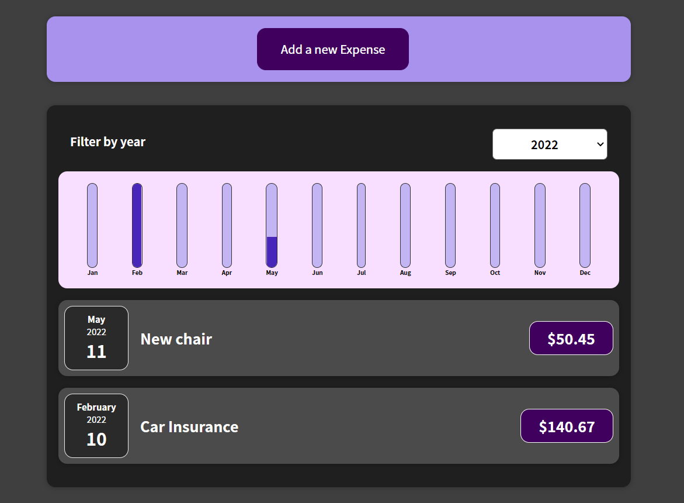

<h3 align="center">$</h3>
<h3 align="center">Expense tracker project</h3>

<p align="center">
    A little project created to practice React.js basics.
    <br />
    <a href="https://github.com/Carmenprz/expense-tracker"><strong>Explore the docs »</strong></a>
    <br />
</p>
<br />
<div align="center">
    
    </br>
    <figcaption>Expense Tracker App</figcaption>
</div>
<br />

## Getting Started

This is an example of how you may give instructions on setting up your project locally.
To get a local copy up and running follow these simple example steps.

### Installation

1. Clone the repo
   ```sh
   git clone https://github.com/Carmenprz/expense-tracker.git
   ```
2. Install NPM packages
   ```sh
   npm install
   ```
3. Serve at localhost:3000
   ```sh
   npm start
   ```

## Practiced concepts Roadmap

- [x] Handle form submission.
- [x] Practice UseState hook.
- [x] Learn Lift State Up concept.
- [X] Work with events and State.
- [x] Implement Two-way binding.
- [x] Output conditional content.
